# Effects of Weather Events on Flight Delays and Cancellations

## Introduction

"Your flight has been cancelled." These may be the five most hated words for an airline passenger. They disrupt travel plans, cost everyone time and money, and can hurt an airline's reputation. However, in some cases an airline has no choice but to cancel a flight, or to delay one. If we could create an algorithm that would allow an airline to discover that they need to delay or cancel a flight a long time in advance, they could buy time for the customer to change their travel plans, perhaps with the help of that airline.

This project seeks to form a causal relationship of weather events on the likelihood of commercial airline flight delays and cancellations. Flight data was compiled from the Bureau of Transportation Statistics website; weather events were taken from a Kaggle webpage (URL below) based on the paper "Short and Long-term Pattern Discovery Over Large-Scale Geo-Spatiotemporal Data" by Moosavi, et al. All flights in 2016-2019 from four airports in 2018, and the weather events in those cities, were selected.

## Data

### Data Fields

The data required extensive preprocessing before analysis; details can be found in the Exploratory Data Analysis (EDA) writeup. Processed data can be found in the `departure_events.csv` file. The origin city and departure date uniquely identify each record. All other fields represent the daily summary of each airport. `departure_events.csv` has the following columns:

* ORIGIN: Three-letter IATA airport code
* DepartureDate: Date of the flights' departures
* ArrivDelay: Arriving flights delayed
* DepartDelay: Departing flights delayed
* Flights: Total departing flights
* WeatherCancelled: Departing flights cancelled due to weather
* WeatherDelayed: Departing flights delayed due to weather
* Cold: Whether the daily temperature dropped below -10.7 F (0 or 1)
* Fog: Presence of fog (0, 1=Light, 2=Heavy)
* Hail: Presence of hail (0 or 1)
* Wind: Wind over 40 mph (0 or 1)
* Rain: Presence of rain (0, 1=Light, 2=Medium, 3=Heavy)
* Sleet: Presence of sleet (0 or 1). Note: The paper did not distinguish between hail and sleet; this had to be done manually. Details are given below.
* Snow: Presence of snow (0, 1=Light, 2=Medium, 3=Heavy)
* FracCancelled: Fraction of the departing flights cancelled due to weather
* FracDelayed: Fraction of the departing flights delayed due to weather
* Month: Numerical month of the year (1-12)
* Season: (Winter, Spring, Summer, Fall)
* Region: Region of the country based on the location of the airport (West, Midwest, Northeast, South, Florida)

Several of these columns will be removed during this step of the process.

### Sources

[Weather data](https://www.kaggle.com/sobhanmoosavi/us-weather-events)

[Flight data (URL subject to change)](https://www.transtats.bts.gov/Tables.asp?DB_ID=120&DB_Name=Airline%20On-Time%20Performance%20Data&DB_Short_Name=On-Time)

### Airport Selection Strategy

To analyze the flights, we need to select our airports. Flights can be affected
by issues at either the departure airport or the arrival airport.

Let's think about the level of complexity that this could induce. Consider a
directed graph with N nodes and V vertices, where every node is connected in
both directions to every other node. The nodes represent the airports, and the
vertices represent flights between the airports. There are V(N) = N(N-1)
vertices in this graph. Here is a table of that function with N = 1, 2,..., 10:

N  V<br>
1  0<br>
2  2<br>
3  6<br>
4  12<br>
5  20<br>
6  30<br>
7  42<br>
8  56<br>
9  72<br>
10  90<br>

This scales up quickly! With over 25 million flights with which to work, perhaps
it is better to choose just a few airports and develop our model as a proof of concept.

There are a number of ways we could justify choosing our airports. We could take
the list of busiest airports and pick the top few. However, we would like to pick
airports that are not just busy but have different climates with different type of
weather events. For instance, northern states are more likely to get snowstorms in the
winter, southeastern states are more likely to get pop-up thunderstorms in the
summer, and western states are often unaffected by weather entirely. We also
need to keep the number of airports chosen low as discussed earlier. Finally,
we would like to choose airports that are major hubs and important international
gateways.

Based on these factors, we choose four airports:

(1) Atlanta: The world's busiest airport for years is home to Delta Airlines.
Air traffic there is occasionally disrupted by rain.

(2) New York-JFK: A hub for American and Delta Airlines and a major gateway
to Europe, JFK Airport routinely has to contend with snowstorms in the winter.

(3) Chicago O'Hare: The busiest airport in the region is also sometimes impacted
by winter weather. It has recently undergone a multi-billion-dollar makeover
that realigned many of its runways.

(4) Miami: Another American hub, Miami enjoys warm weather year-round, but
summertime storms are common. It is a gateway to South America.

### Data Wrangling

The flight data was provided in an easily-accessible data format from the Bureau of Transportation Statistics, only needing modification of flight arrival and departure times into their local time zones. The weather data, however, came in the form of "codes" that did not seem to match well to actual weather events. Worse, the light/medium/heavy codes for snow and rain did not overlap in a natural "stairstep" form; for instance, it was common for a "light" snow to end after a concurrent "medium" snow began. Resolving these inconsistencies was a significant part of the data wrangling. Once this was done, the weather and flight data could be merged.

The next step was to merge the weather and flight data. It was necessary to recognize that flights could be affected by weather events just before or after the scheduled departure or arrival time, particularly when it came to snow. Thus a flight was assumed to be affected by weather if it was within a certain amount of time of a weather event, more for snow, especially heavy snow, as it can take hours to recover after a major snowstorm. Finding the right length of these times is beyond the scope of this project.

This association between flights and weather events was made both for departures and cities, and arrival times and cities.

## Exploratory Data Analysis

After this union of weather and flight data, we examine the combined data and look for any trends that may guide us towards analysis strategies.


Contrary to what we would expect, there are some significant differences between departure and arrival delays and cancellations. Miami has many more departure delays than arrival delays in the summer, and a lesser but reversed effect is true at JFK. Miami is known for having frequent thunderstorms during the summer; perhaps they affect the departure process more than the arrival process. Also notice that there is a large cancellation spike for Miami in September. This was likely caused by Hurricane Irma in September 2017, which shut down Miami International Airport. Because our weather does not account for actual hurricanes, if we left these cancelled flights in, the model would associate the heavy rain and wind with a lot of cancellations here. Therefore, we should remove them.

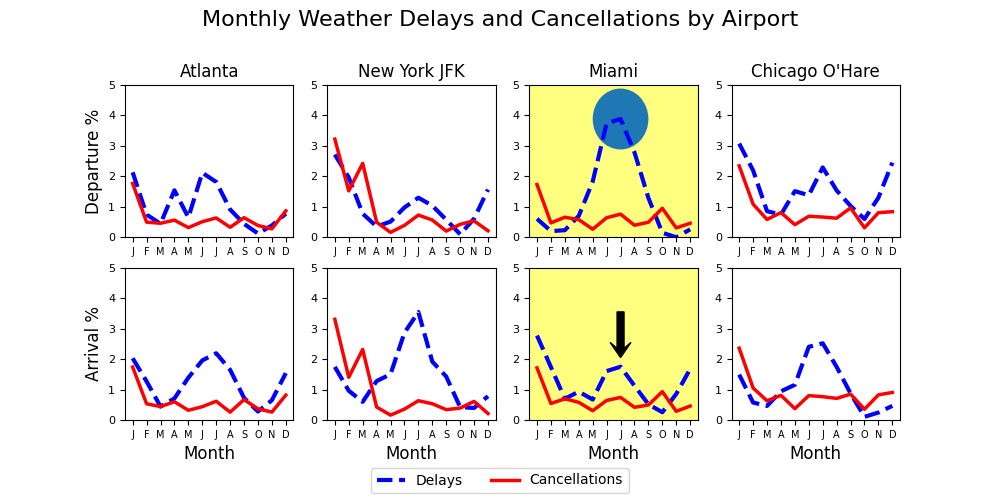

Miami's September spikes are gone. Notice that the other airports also lose some smaller spikes caused by the flights that were scheduled to and from Miami during Hurricane Irma.

Let's see if there are any more particular trends between the airports. We construct another, 4x4 plot of delay and cancellation rates from each of our four airports to each other airport.

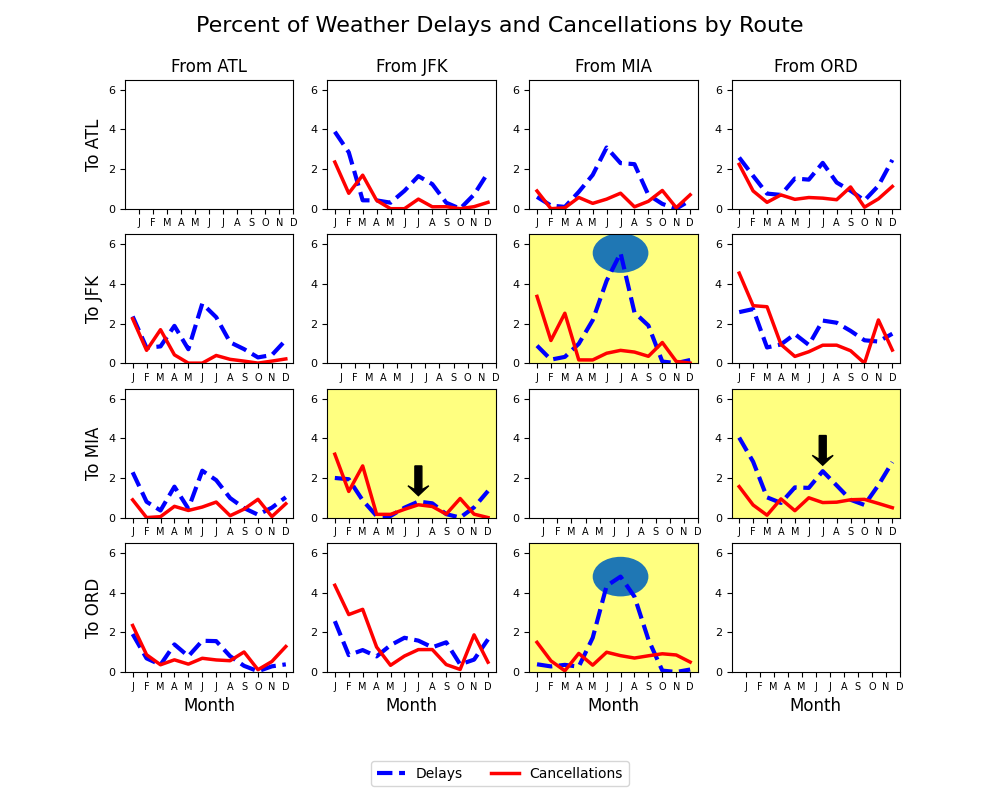

The asymetry between departure and arrival delays is now spread around the individual routes. For instance, the lack of symmetry between Miami's departure weather delays to JFK and O'Hare and arrival delays from them is stark. The lack of this effect at the other three airports suggest this is an actual issue with delays from Miami International Airport and not a bug in the data. However, the cancellation data is nearly symmetric, suggesting that when flights are cancelled due to weather, both departing and arriving flights are cancelled.

Now let's see if there is a correlation between time of day and delays/cancellations.

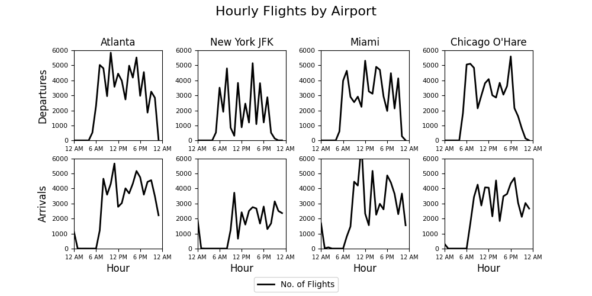

In general, flights depart between 5 AM - 11 PM and arrive between 6 AM - midnight. Very few of our flights are scheduled to depart or arrive outside of these timeframes. Note that this timeframe is somewhat shorter for JFK, possibly due to flight time restrictions.

We will visually denote these times on the next set of charts: Hourly delay and cancellation rates, per airport, categorized by arrivals and departures.

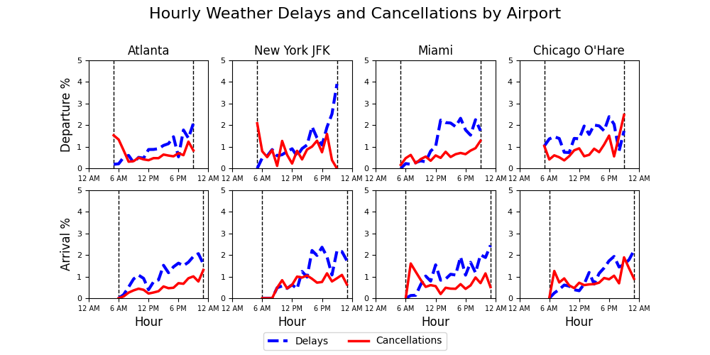

As explained above, the spikes for Miami's arrivals and Atlanta's and Chicago's departures occur during a window of very few flights and should be taken with a grain of salt. Note that both departure and arrival delay percentages are uncommon in the morning but increase as the day goes on; this effect is much sharper for Miami's departures after 12 PM. The overall pattern is probably due to both thunderstorms' being more common in the afternoon and airports' runway capacity being reduced during heavy rains.

### Analysis

In the weather dataset, binary variables such as Cold are listed as 0 and 1; multi-value variables such as snow and rain, which are listed as light, medium, or heavy, are assigned values of 1, 2, and 3, respectively, with 0 as no rain/snow.

After some data trimming, we get the following logistic regression analyses for cancellations and delays. "ArrRain" means the rain code at the arrival city, "DepSnowSqu" means the snow code at the departure city, and so forth. These are taken over the complete dataset and not meant to be final analyses.

```
Logistic regression analysis: Cancellations
Optimization terminated successfully.
         Current function value: 0.035928
         Iterations 10
                           Logit Regression Results                           
==============================================================================
Dep. Variable:       WeatherCancelled   No. Observations:               214986
Model:                          Logit   Df Residuals:                   214975
Method:                           MLE   Df Model:                           10
Date:                Fri, 27 Nov 2020   Pseudo R-squ.:                  0.1554
Time:                        14:22:55   Log-Likelihood:                -7724.0
converged:                       True   LL-Null:                       -9145.1
Covariance Type:            nonrobust   LLR p-value:                     0.000
==============================================================================
                 coef    std err          z      P>|z|      [0.025      0.975]
------------------------------------------------------------------------------
const         -5.7211      0.040   -142.996      0.000      -5.800      -5.643
ArrCold        3.3821      0.248     13.662      0.000       2.897       3.867
ArrRain        0.3428      0.032     10.666      0.000       0.280       0.406
ArrSleet       1.1403      0.234      4.878      0.000       0.682       1.598
ArrSnow        2.2421      0.129     17.329      0.000       1.989       2.496
ArrSnowSqu    -0.3626      0.048     -7.479      0.000      -0.458      -0.268
ArrWind        2.4453      0.195     12.567      0.000       2.064       2.827
DepCold        3.8611      0.231     16.730      0.000       3.409       4.313
DepRain        0.4715      0.030     15.754      0.000       0.413       0.530
DepSnow        2.4119      0.126     19.201      0.000       2.166       2.658
DepSnowSqu    -0.3920      0.047     -8.401      0.000      -0.483      -0.301
```

```
Logistic regression analysis with variable set trimmed: Delays
Optimization terminated successfully.
         Current function value: 0.058184
         Iterations 9
                           Logit Regression Results                           
==============================================================================
Dep. Variable:         WeatherDelayed   No. Observations:               214986
Model:                          Logit   Df Residuals:                   214979
Method:                           MLE   Df Model:                            6
Date:                Fri, 27 Nov 2020   Pseudo R-squ.:                  0.1269
Time:                        14:22:57   Log-Likelihood:                -12509.
converged:                       True   LL-Null:                       -14327.
Covariance Type:            nonrobust   LLR p-value:                     0.000
==============================================================================
                 coef    std err          z      P>|z|      [0.025      0.975]
------------------------------------------------------------------------------
const         -5.1928      0.033   -159.079      0.000      -5.257      -5.129
ArrCold        1.2085      0.528      2.289      0.022       0.174       2.243
ArrRain        0.1873      0.026      7.218      0.000       0.136       0.238
DepCold        2.4707      0.301      8.222      0.000       1.882       3.060
DepHail        1.1674      0.316      3.699      0.000       0.549       1.786
DepRain        1.1279      0.063     17.903      0.000       1.004       1.251
DepRainSqu    -0.0147      0.021     -0.700      0.484      -0.056       0.026
==============================================================================
```

The two biggest contributors to weather delays are rain and snow. The following four charts are of the percentage of flights between our four airports delayed or cancelled by rain or snow, categorized by the values of their rain/snow codes and whether the issue occurs at the departure or arrival airport.

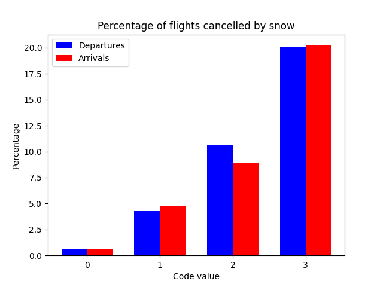 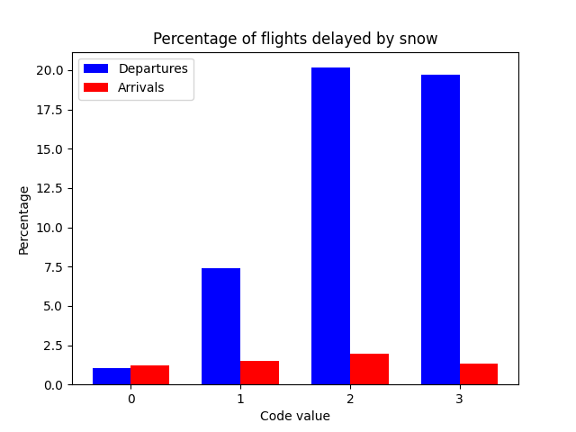

As expected the percentages of flights cancelled by snow on the departure and arrival side are roughly equal per weather code, but there are significantly more departures delayed by snow than arrivals. Let's do a logistic regression to see if this is a consistent pattern. Without loss of generality, we will run this test over just the flights with a snow code value of 2, since there are many more of them than for a snow code value of 3.

Also notice the decrease in delays from snow code values of 2 to 3. This is probably due to a significant rise in cancellations. A flight cannot be classified as both delayed and cancelled.

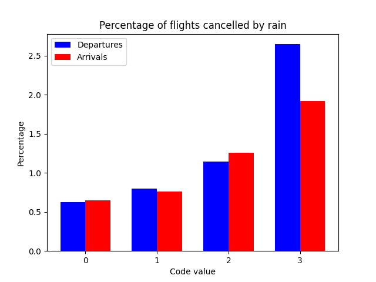 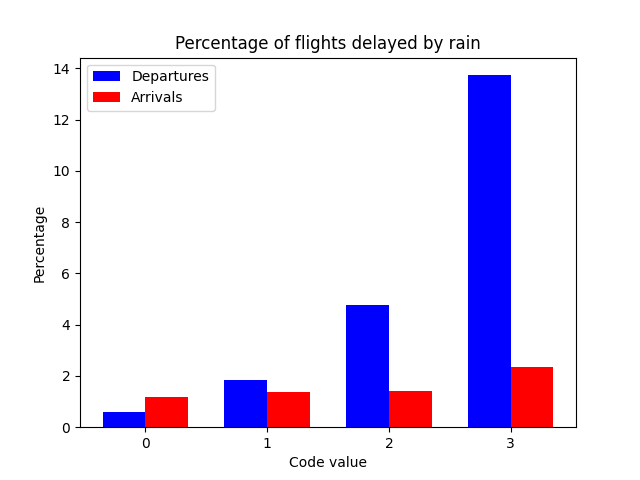

The departure-arrival split is similar for the rain for both the delays and cancellations. This time, the rise in arrival delays is steady all the way through a rain code value of 3. Perhaps airports can still accept arriving airplanes during heavy rain as long as there is no severe weather, which would force a ground stop.

We need to consider how many of our flights actually have each of these codes. Since the flights seem much more vulnerable to delays on the departure end, we will focus there.

### Key Takeaways

Snow and rain have the strongest effects on flights. In particular, snow can cause delays on the departure end and cancellations on both ends of the flight, and rain can delay flights on the departure end. In all cases, these effects are more pronounced with more intense weather. With rain, airplanes can still depart and arrive, but extra measures such as increased spacing between planes on approach to a runway and preparing the planes for departure are necessary; this impedes an airport's ability to process flights and can create delays. In addition to these challenges, mild to moderate snow can require deicing procedures prior to departure, which explains all the departure delays for snow. Major snowstorms can shut down airports entirely.

We should focus on these effects as we attempt to train the data and need to start trimming explanatory variables to simplify the training process.

## Training

We attempt to fit the data using three learning methods: Logistic regressions, random forests, support vector classifiers. We will use 5-fold cross validation, and we will attempt a parameter sweep to determing the best fit. Because the overwhelming majority of observations are negatives, we need a balanced weighting of observations with the cross-validation: Half negatives, half positives.

The goal is to use the values of the weather codes to predict whether a flight will be cancelled or not, and whether it will be delayed or not. These will be treated as two separate problems for the purposes of training. We look for the classifier and parameter set that gives us the best mean test score.

### Logistic Regressions

Scenarios with binary outcomes such as ours tend to be prime candidates for modeling with a logistic regression, so we try this first. An advantage of logistic regressions is that the output of the classifier is not a binary decision but a likelihood which can set after the training is done. This makes them a prime candidate as a classifieer. We do a parameter sweep of C from 10^(-2) to 10^(3), separated logarithmically. The parameter turns out to make little difference, but C=1 gets us slightly better results. The mean test score is 0.781 for cancellations and 0.831 for delays.

### Random Forests

Decisions trees are easy to create but tend to overfit the data. To overcome this, we can use a random forest, which takes a random sample of trees built on bootstrapped data. Input parameters are the number of trees and the maximum depth of each tree. After some parameter sweeping, we settle on a 50-tree forest with up to three splits per tree for both cancellations and delays. The mean test score is 0.767 for cancellations and 0.829 for delays.

### Support Vector Classifiers

The SVC is slow to train with a large amount of data, so we resampled the data as we narrowed down the ideal parameters. In particular, since most results were negative, only the negatives were resampled, and all positives were retained. When resampling over every five negative data points and all positive points, we get a mean test score of 0.754 for cancellations and 0.801 for delays.

### Model Selection

Ideally we would like a classifier that is quick to train, minimizes the risk of false negatives and positives, and is adaptable post-training. With our data, the logistic regression fits the bill in all three cases. We can train the data then set the threshold to see what will give us the best results. 

## Analysis

### ROC Curves

The true positive rate (TPR), also called the sensitivity, is defined as probability of predicting a positive given an actual positive; the false positive rate (FPR) is the probability of predicting a positive given an actual negative. Clearly we want to maximize the TPR and minimize the FPR. However, these are competing goals. Lowering the the logistic regression's threshold of acceptance will increase the likelihood that we will make a positive prediction regardless of the actual, which will increase the TPR but also the FPR. Likewise, we cannot lower the FPR by increasing the threshold without dragging down the TPR.

One tool we can use to help us find the optimal threshold is to simply plot the TPR and FPR as a function of the threshold. We do that now for the cancellations and delays.

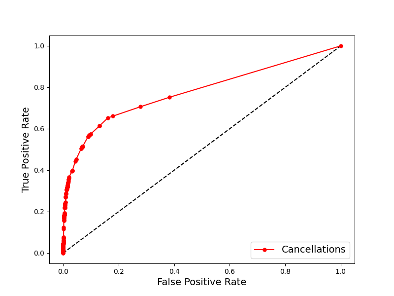

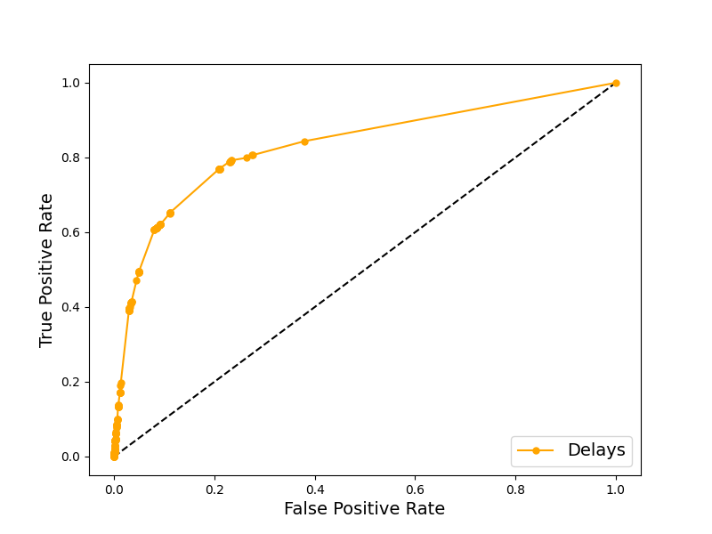

Most of the dots for both the cancellations and delays have a very low FPR but also a low TPR. This is likely due to the overwhelming majority of flights not being delayed nor cancelled, so there are not many positives to sample in either case. Also, since we want to maximize the TPR but minimize the FPR, we should switch the measures to two that we want to both minimize or both maximize. For reasons we will discuss later, we will switch from attempting to maximize the TPR to minimizing the False Negative Rate, which is simply 1 minus the TPR.

### Delays and Cancellations
Before proceeding, we should discuss what false positives and false negatives mean in the context
of our model, which is used to predict whether a flight will be cancelled or
delayed, not whether to make the decision to delay or cancel a flight. Ideally
the decision would be an internal one to make preparations for an upcoming
delay or cancellation. A false positive means that such preparations are made
when there is no cancellation/delay, and a false negative means that no
preparations are made ahead of time when there is a cancellation or delay.

#### Delays
In an ideal world, if it could be known with perfect certainty whether a flight
would be delayed, airlines could make adjustments accordingly. They could
adjust crew schedules and send out customer notifications that a flight is
expected to be depart (or arrive) late. But if an airline does so by mistake,
they will not have their crew present, which will shift a weather-based delay
to an airline-based delay. Furthermore, they may irritate passengers who
thought they had a greater time margin of error than they actually had.

On the flip side, if passengers and crew show up thinking that the flight will
be on time but it actually isn't, there is less risk to the airline. Delays
are a normal part of flight travel, and customers are less likely to be
irritated by the airline if they don't find out about the delay until they
arrive at the airport. Furthermore, delays are rarely more than an hour, and
large airports especially have plenty for departing passengers to do as they
wait to fly. So if the evidence is not overwhelmingly in favor of predicting
that a flight will be delayed until a delay is actually announced, an airline
shouldn't do so. This means that the cost of a false negative is far less than
that of a false positive.

#### Cancellations
Cancellations are rarer than delays, which is a good thing, because
cancellations disrupt travel much more severely than delays. In some cases,
including with the dataset available to us, cancellations can involve entire
airports shutting down for a day or more. If an airline could have a tool that
could preemptively avoid the expensive of bringing the plane and crew to the
gate for a flight that never happens, they could save a lot of money. But a
false positive here means not scheduling a flight that should have flown. This
is a catastrophic decision that can cost the in both the short and long run.

### Plots
We are going to focus on two specific sets of misclassifications: the
false omission rate (FOR), instances where the outcome is positive in spite
of a negative prediction, and the false positive rate (FPR), instances where we
predicted what turned out to be a negative situation as positive.

Both have costs associated with them but very different costs. The FOR is the
portion of cases that "slip through the cracks": flights that we project would
not be cancelled/delayed but turn out to be. Likewise, the FPR is the portion 
of flights that are not cancelled or delayed but we projected would be.

The FOR is problematic for the customer experience: Passengers come to the
airport, expecting to fly, but their flight is delayed or cancelled. The FPR
is problematic for the airline: The flight should have been flown and on time
but was not.

Next we need to assign a value to each. We assume for simplicity that a false
positive will induce the same problem that we attempted to avoid: A false
positive delay will cause a flight delay, and a false positive cancellation
will cause the flight to be cancelled. We do not have cost figures available
to know the relative costs of each; acquiring that data is beyond the scope
of this project. However we can still build the model as a proof of concept
with the ability to tune this ratio. Let C = cost. We assume that for both
delays, and cancellations, C(FOR) = 25 times C(FPR).

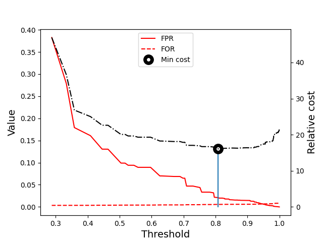

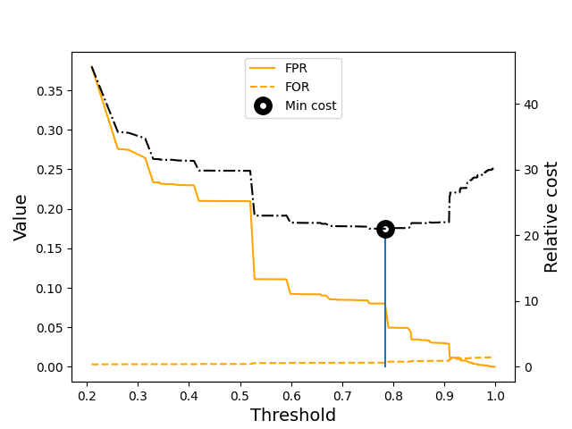

## Conclusion

In our model, to minimize costs associated with cancellations, the threshold should be set to just above 0.8, and with delays it should be set to just under 0.8. This means that for both cancellations and delays, the airline should cancel/delay the flight if and only if the data suggest there is about an 80% chance of the need to do so. This will create quite a few false positives, but we must recall the serious danger of false omissions and how they are much more expensive in the long run than false positives. Until the airline can get a better model, likely from better weather data, it will have to accept some false positives as part of the cost of doing business.
